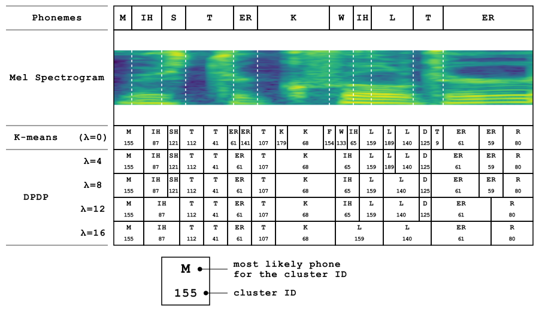
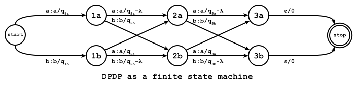
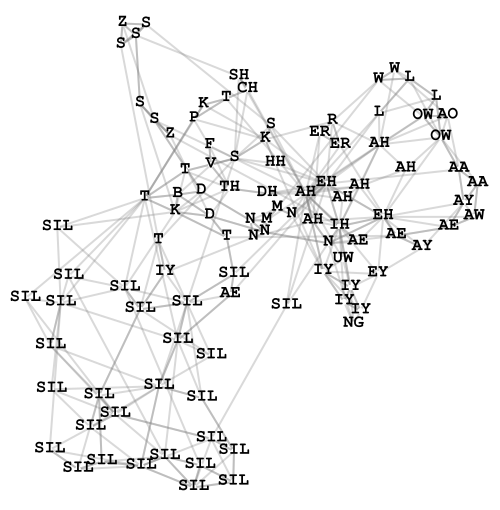
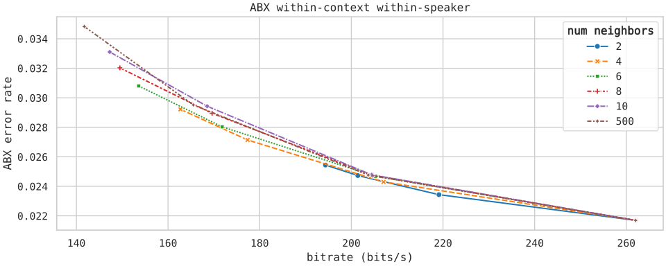

# DP-WFST

A weighted finite-state transducer (WFST) algorithm for duration-penalized dynamic programming.

When used for acoustic unit discovery, the DP-WFST algorithm can discover phone-like units from speech models like HuBERT and WavLM.

Compared to the original DPDP algorithm, the DP-WFST algorithm is more flexible. In this formulation, we can limit the search to a few nearest neighbors of each feature vector.
This makes the DP-WFST algorithm much faster than the DPDP algorithm while still being able to discover phone-like units.

## Background

### Bigger vector-quantized units

Duration-penalized dynamic programming (DPDP) is an algorithm that quantizes features to a codebook while encouraging bigger units.
When the DPDP parameter ($\lambda$) is zero, DPDP finds the $K$-means predictions.
When we increase $\lambda$, we encourage finding larger units - the higher $\lambda$ the larger the units.

Below, we show a visualization of the DPDP units for speech containing the words "Mister Quilter".
Here can see how the DPDP units have durations more in line with the expected phone durations.



We give code for the dynamic programming algorithm in `dpdp.py`. This follows the algorithm described in Kamper's [paper](https://arxiv.org/abs/2202.11929).

### Finite-state machine

We can also express the objective used in Kamper's [paper](https://arxiv.org/abs/2202.11929) as a weighted finite-state transducer (WFST).
Below, we show this WFST for 2 codebook entries (a and b) and 3 time steps (1,2,3).



$q_{tk}$ is defined as the cost of quantizing the $t^\mathrm{th}$ feature to the $k^\mathrm{th}$ codebook entry.
$q_{tk} = \| \mathbf{x}_t - \mathbf{c}_k \|^2$

We give code for finding DPDP units with this WFST in `dpwfst.py`.
This implementation uses the [k2](https://github.com/k2-fsa/k2) library.
It runs natively in PyTorch on the CPU or GPU.

### Faster algorithm with approximate DPDP units

Instead of searching the entire codebook, we can limit the search to the $N$ nearest neighbors of each feature.

Below, we show a visualization of the nearest neighbors in a $K$-means codebook.
Here, each node represents a codebook entry.
We label the node with the most likely phone label associated with the codebook entry.
Edges are placed between a codebook entry and a few nearest neighbors.



If the aim of the DPDP units is to find phone-like units, we can limit the search to a very small number of neigbors.
We therefore include a `num_neighbors` parameter in the `dpwfst` function in `dpwfst.py`.

When using WavLM features and a codebook size of 500, we could limit the number of neigbors to as low as 4.
This speeds up the DP-WFST search significantly.
We evaluated this assumption using ABX phone discriminability.
We found the units to be slightly favorable compared to using the full codebook (K=500).


## Usage

### Quickstart

Follow this [guide](https://k2-fsa.github.io/k2/installation/from_wheels.html) to install PyTorch and k2 with CUDA support.

If you don't mind using an older version of PyTorch, you can use the following:

```
pip install torch==2.0.1+cu117 -f https://download.pytorch.org/whl/torch/
pip install k2==1.24.3.dev20230718+cuda11.7.torch2.0.1 -f https://k2-fsa.github.io/k2/cuda.html
```

If you get stuck you can use the CPU only version.

Then you can run the example in `example.ipynb`.

### For use in training frameworks

I highly recommend using docker if you plan on using k2 during training.
You can then use a more recent version of PyTorch while avoiding dependency hell.

The `pytorch/pytorch:2.4.0-cuda12.1-cudnn9-runtime` docker image works well. You then only need to install the appropriate k2 wheels from [here](https://k2-fsa.github.io/k2/installation/pre-compiled-cuda-wheels-linux/index.html).